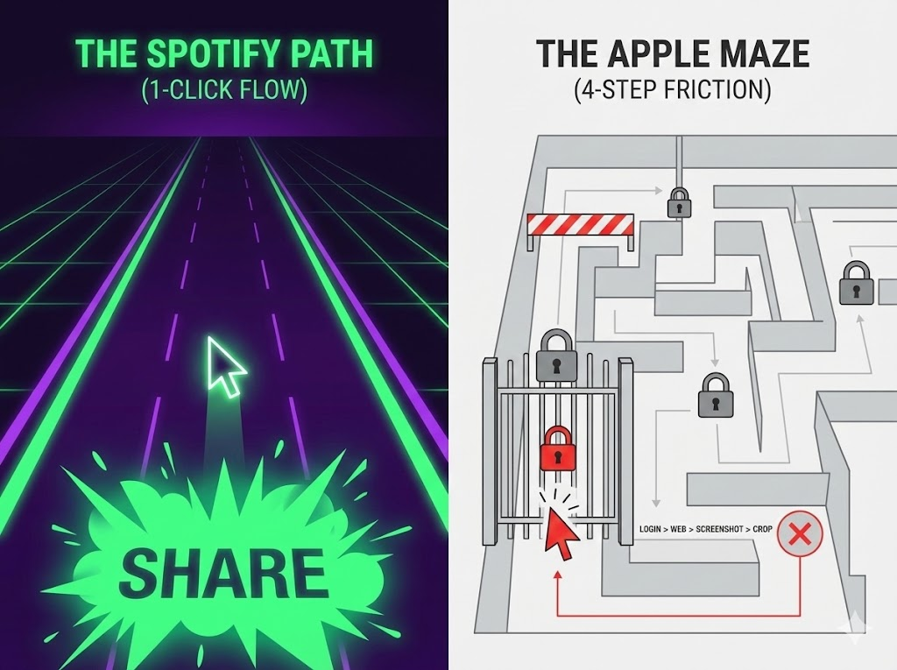
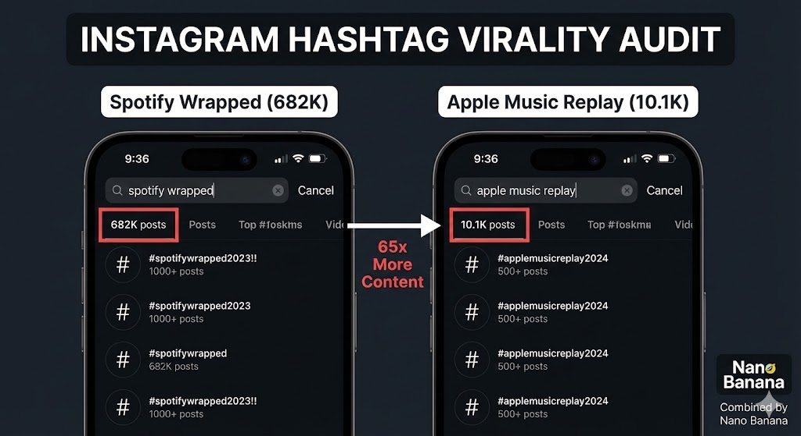
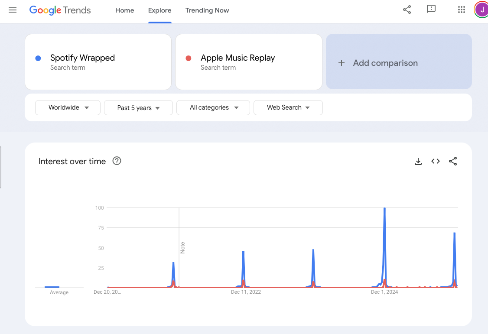

# spotify-wrapped-vs-apple-replay-behavioral-growth-audit

A comparative behavioral growth audit examining how product friction may influence social distribution efficiency, using Spotify Wrapped and Apple Replay as a public-signal case study.

## Business Question

Why did two similar year-end music recap products generate very different levels of visible social distribution, and what might that reveal about how product friction affects share conversion and growth efficiency?

## Project Context

This project began as a comparative case study based on a visible real-world distribution gap: Spotify Wrapped consistently generated heavy public sharing, while Apple Replay appeared far more muted despite offering a similar year-end recap experience.

The goal was not simply to compare two products, but to investigate whether small differences in user flow, sharing friction, and broadcast readiness could help explain why one experience spread more effectively than the other.

## Analytical Approach

This repo revisits the original case study and strengthens it with clearer methodological framing. The comparison was approached as a behavioral growth audit using public signals, product-flow observation, and distribution proxies rather than internal platform data.

The analysis focused on three layers: the visible distribution gap, the likely friction points within each user journey, and the broader business implications of how product design may influence sharing efficiency.

## Repo Structure

- `README.md` — project overview, business question, and case framing
- `docs/methodology.md` — comparison logic, evidence types, and analytical boundaries
- `docs/key-findings.md` — core observations, interpretations, and business meaning
- `docs/assumptions-and-limitations.md` — key assumptions, evidence limits, and caution areas
- `data/source-log.md` — source tracking and notes on what each source supports
- `data/raw/` — original source captures or reference material
- `data/processed/` — cleaned notes, comparison tables, or structured summaries
- `assets/` — supporting visuals, screenshots, and diagrams

## Reading Path

Start with this README for the project overview, then move to `docs/methodology.md` for the comparison logic, `docs/key-findings.md` for the main conclusions, and `docs/assumptions-and-limitations.md` for the evidence boundaries and caution areas.

## Current Evidence Status

This repo currently contains the reconstructed case framework, methodological boundaries, early source inventory, and first-pass comparison notes. 
Additional raw captures, public-signal references, and flow evidence can be added over time to strengthen the case's evidence base.

## Visual Evidence Preview
These visuals provide early support for the case's core comparison: visible circulation gap, product-flow friction, and recurring public attention differences.

### Flow Comparison

### Instagram Hashtag Audit

### Google Trends Comparison

## Deeper Evidence Trail

For raw source tracking, see `data/raw/source-inventory.md`.  
For cleaned comparison logic, see `data/processed/comparison-notes.md`.
