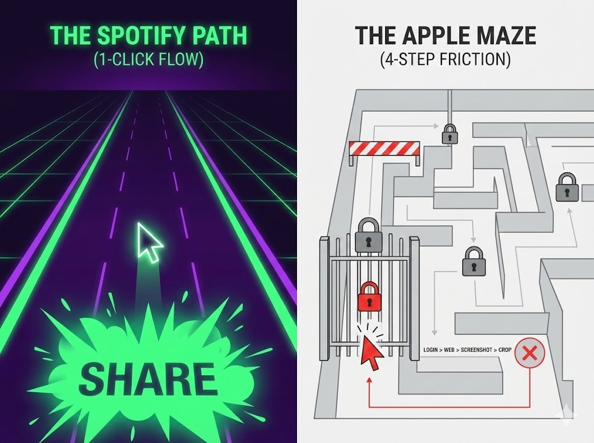
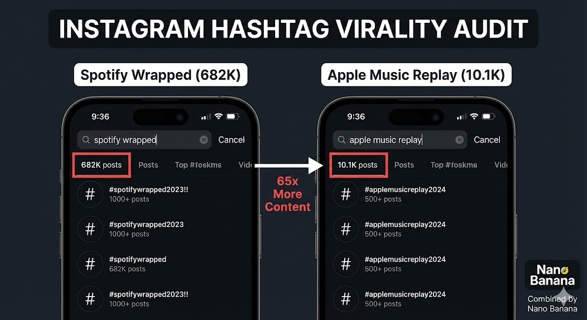
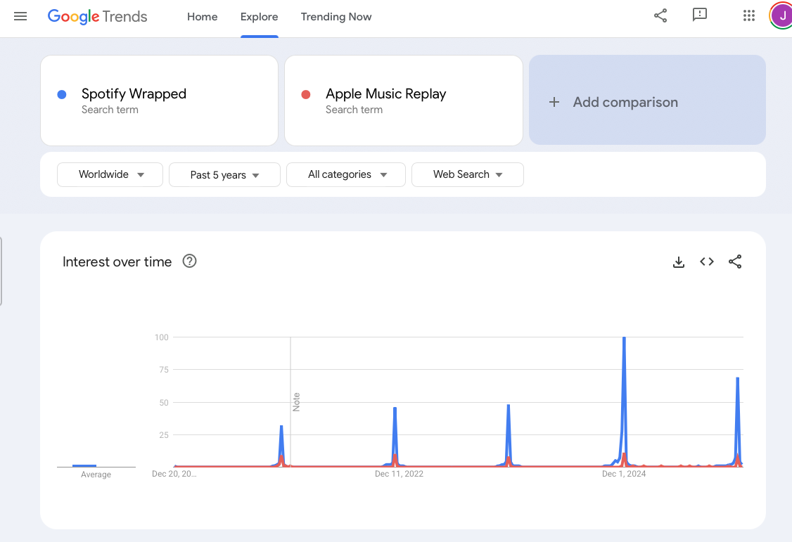

# Behavioral Growth Audit: Spotify Wrapped vs Apple Music Replay

A comparative behavioral growth audit examining how product friction may influence social distribution efficiency, using Spotify Wrapped and Apple Replay as a public-signal case study.

## Business Question

Why did two similar year-end music recap products generate very different levels of visible social distribution?

More specifically:

**How might product friction, sharing mechanics, and identity expression affect whether a recap experience becomes privately consumed or publicly shared?**

## Key Finding

The performance gap was not only about creative quality.

Spotify Wrapped appeared to work better as a **public identity-sharing system**, while Apple Music Replay functioned more like a **personal recap tool**.

The difference was shaped by:

- how quickly users could access and share the experience
- how visually ready the output felt for social platforms
- how strongly the recap helped users express identity
- how easily the product experience moved from private reflection to public posting

In simple terms:

**Spotify made sharing feel like part of the product. Apple Replay made sharing feel more like an extra step.**

---

## Why This Matters for Marketing

This project is relevant to marketing because viral performance is not only about making good content.

A campaign spreads when the audience can easily:

- understand the message
- personalise the experience
- feel social value from sharing it
- post it with low friction
- use it to express identity publicly

For marketers, this means distribution should be designed into the experience, not treated as something that happens after the content is created.

A strong campaign does not only ask:

**“Is this creative good?”**

It also asks:

**“Is this easy, rewarding, and natural for people to share?”**

---

## Project Context

This project began as a comparative case study based on a visible real-world distribution gap.

Spotify Wrapped consistently generated heavy public sharing and social conversation, while Apple Music Replay appeared more muted despite offering a similar year-end recap experience.

The goal was not to declare one product “better” overall.

The goal was to investigate whether differences in user flow, sharing friction, emotional payoff, and broadcast readiness could help explain why one experience appeared to spread more effectively than the other.

---

## Analytical Approach

This project was structured as a behavioral growth audit using public signals, product-flow observation, and distribution proxies rather than internal platform data.

The analysis focused on three layers:

1. **Visible distribution gap**  
   Comparing public-facing signs of social visibility, including hashtag activity and search interest.

2. **Product and sharing friction**  
   Reviewing how easily each experience could move from recap viewing to public sharing.

3. **Marketing and growth interpretation**  
   Interpreting what the difference reveals about user behaviour, social identity, and organic amplification.

The analysis does not claim access to internal Spotify or Apple data. It is based on observable public evidence and structured interpretation.

---

## Evidence Used

This repo uses several types of public-facing evidence:

- Instagram hashtag comparison
- Google Trends comparison
- Product-flow observation
- Sharing-friction comparison
- Visual evidence and screenshots
- Structured comparison notes

These signals are used as directional evidence, not as a complete measurement of total platform performance.

---

## Evidence Preview

Spotify Wrapped appeared to provide a smoother and more share-ready path from recap experience to public posting.

Apple Music Replay appeared to involve more friction before the experience could become a social post.

This matters because every extra step can reduce the likelihood that a user shares publicly.

### Instagram Hashtag Audit

The Instagram hashtag comparison showed a large visible gap between public content associated with Spotify Wrapped and Apple Music Replay.

This does not prove total campaign performance by itself, but it supports the idea that Spotify Wrapped created stronger public posting behaviour.

### Google Trends Comparison

Google Trends showed recurring spikes in public search attention around Spotify Wrapped, with Apple Music Replay showing a much smaller visible pattern.

This supports the broader interpretation that Spotify Wrapped became a larger recurring public moment.

## Main Interpretation

Spotify Wrapped did not spread only because people liked the design.

It spread because the experience was built around social behaviour.

The product helped users answer:

- What does my music say about me?
- How do I show that to others?
- Can I share it quickly?
- Will it look good in public?
- Will other people understand it immediately?

Apple Music Replay offered recap value, but appeared less optimised for public identity signalling and low-friction sharing.

That difference matters because in social marketing, the user is not only the audience.

The user can also become the distribution channel.

---

## Marketing Lessons

This project suggests several marketing lessons:

1. **Shareability should be designed early**  
   If sharing is treated as an afterthought, fewer users will complete the path from experience to post.

2. **Identity expression increases organic distribution**  
   People share content more easily when it helps them say something about who they are.

3. **Friction reduces amplification**  
   Even a strong idea can lose reach if the sharing path is too slow or unclear.

4. **Public visibility is different from product usefulness**  
   A product can be useful privately but still weak as a social growth mechanism.

5. **Viral marketing depends on behaviour, not only creativity**  
   The best creative idea still needs a user journey that makes participation easy.

---

## Contribution and AI Disclosure

This was a self-directed individual project.

I handled the concept, research structure, comparison logic, writing direction, visual evidence selection, and final review.

AI tools were used to support brainstorming, drafting, rewriting, and workflow structuring. Final direction, judgment, interpretation, and quality control were done by me.

